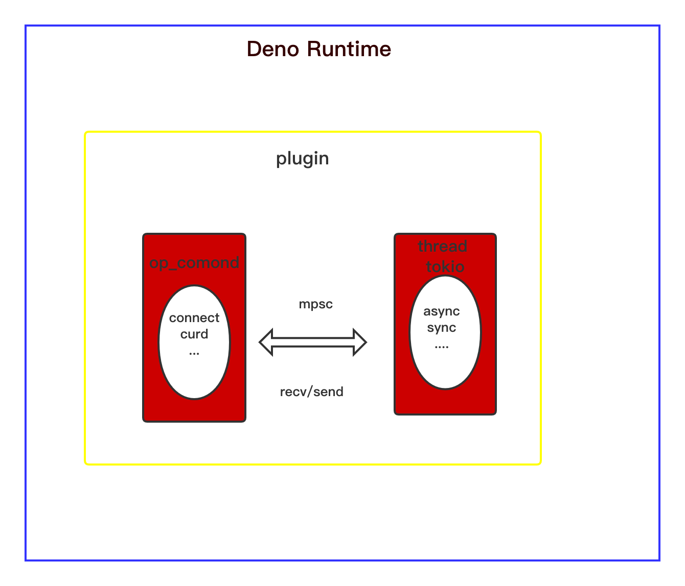

# deno_redis

## perform the test

> RUST_BACKTRACE=full deno run --allow-all test.ts 

## The problem record

The deno load plug-in has no tokio runtime in it。[issue](https://github.com/denoland/deno/issues/4479)

The solution

> A new thread with tokio runtime interacts with dispatch_op for mpsc


## question

> Tested asynchronous performance is not as good as synchronous performance。So it's synchronized，It will be changed to asynchronous later. Here is the original design, but the performance does not improve



> If you can do better through asynchrony, please contact me

## test
### Small sample
#### node 
```js
const redis = require("redis");
const client = redis.createClient();
const time = new Date();
const param = ["key1", "foo", "key2", "foo", 
                    "key3", "foo", "key4", "foo", "key5", 
                    "foo", "key6", "foo", "key7", "foo", 
                    "key7", "foo", "key8", "foo", "key9", "foo"];
client.hmset("test", param, function (err, res) {
  console.log('time',new Date() - time);
});

```
> average: 10ms
#### deno
```ts
  const client: RedisClient = new RedisClient({
    host: '127.0.0.1',
    port: 6379,
    db: 0,
  });
  const param = ["key1", "foo", "key2", "foo", 
                    "key3", "foo", "key4", "foo", "key5", 
                    "foo", "key6", "foo", "key7", "foo", 
                    "key7", "foo", "key8", "foo", "key9", "foo"];
  const time = new Date().getTime();
  await client.connection.hmset("test", param);
  console.log(new Date().getTime() - time);
```
> average: 1ms

### Large benchmark

Waiting for the supplement